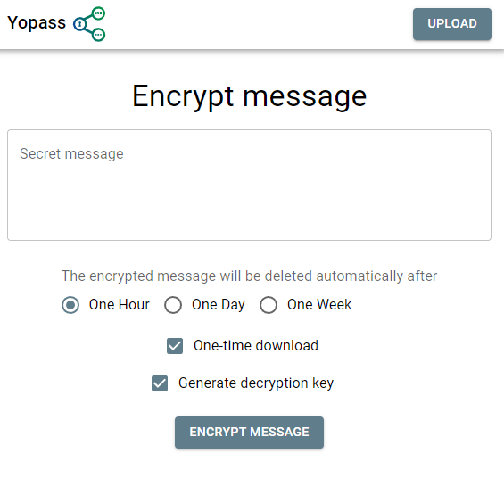

Secret-Sharing
==============

## Yopass

Secure sharing of secrets, passwords and files

- [Github](https://github.com/jhaals/yopass) (⭐ 1.5k)
- [local test](http://localhost:5000)

```sh
cd yopass-insecure
docker compose up -d
```

### UI




## PasswordPusher

🔐 Securely communicate passwords over the web.

[Github](https://github.com/pglombardo/PasswordPusher) (⭐ 1.5k)

```sh
docker run -d -p "5100:5100" pglombardo/pwpush:release
```


## Other

- [Keep your sensitive information out of chat logs, emails, and more with encrypted secrets.](https://github.com/HemmeligOrg/Hemmelig.app) (⭐ 564)
- [sup3rS3cretMes5age](https://github.com/algolia/sup3rS3cretMes5age) (⭐ 437)
- [One-Time-Secret sharing with AES encryption in the browser](https://github.com/Luzifer/ots) (⭐ 366)
- [Share sensitive info without leaving a trace](https://github.com/smallwat3r/shhh) (⭐ 354)
