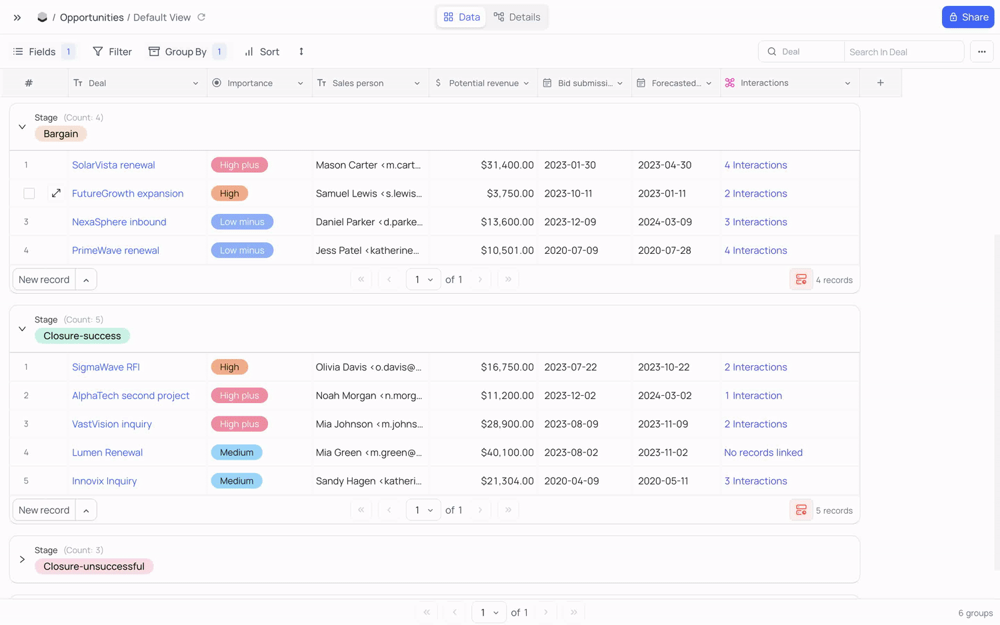

Databases
=========

## Adminer

[Database management in a single PHP file](https://github.com/vrana/adminer) (⭐ 5.9k)

Supports: MySQL, MariaDB, PostgreSQL, SQLite, MS SQL, Oracle, Elasticsearch, MongoDB  
With Plugin: SimpleDB, Firebird, ClickHouse  


## Bytebase

World's most advanced database DevOps and CI/CD for Developer, DBA and Platform Engineering teams. The GitLab/GitHub for database DevOps.

- [Github](https://github.com/bytebase/bytebase) (⭐ 8.3k)
- [Selfhost](https://www.bytebase.com/docs/get-started/self-host)

Supports: Mysql, PostgreSQL, TiDB, ClickHouse, Snowflake, Redshift, Mongo, Spanner, Redis, Oracle, SQL Server, MariaDB, OceanBase, RisingWave  
Features: Schema Migration, SQL Editor, Batch Operations, Branching, Security


```sh
docker run --init -d -p 5005:8080 -v ./bytebase-data:/var/opt/bytebase --name bytebase bytebase/bytebase:2.12.0
```

## Chartbrew

Open-source web platform used to create live reporting dashboards from APIs, MongoDB, Firestore, MySQL, PostgreSQL, and more 📈📊

- [Github](https://github.com/chartbrew/chartbrew) (⭐ 2k)
- [Docker Install](https://docs.chartbrew.com/deployment/#run-the-application-with-docker)


## Cloudbeaver

Support for many, many databases.

- [Github](https://github.com/dbeaver/cloudbeaver) (⭐ 2.7k)
- [Desktop Github](https://github.com/dbeaver/dbeaver) (⭐ 35.3k)
- [Docker Install](https://github.com/dbeaver/cloudbeaver/wiki/Run-Docker-Container)
- [Live Demo](https://demo.cloudbeaver.io)


## Directus

The Modern Data Stack 🐰 — Directus is an instant REST+GraphQL API and intuitive no-code data collaboration app for any SQL database.

- [Github](https://github.com/directus/directus) (⭐ 24.1k)
- [Docker Install](https://docs.directus.io/self-hosted/quickstart.html)


## Mathesar

Web application providing an intuitive user experience to databases.

- [Github](https://github.com/mathesar-foundation/mathesar) (⭐ 2k)
- [Live Demo](https://demo.mathesar.org/)


## Nocodb

🔥 🔥 🔥 Open Source Airtable Alternative

Supports: MySQL, PostgreSQL, SQL Server, SQLite & MariaDB

- [Github](https://github.com/nocodb/nocodb) (⭐ 39.6k)
- [Docker Compose Files](https://github.com/nocodb/nocodb/tree/master/docker-compose)

```sh
# Interactive config
npx create-nocodb-app
```





## MySql

- [MySQL Workbench](https://github.com/mysql/mysql-workbench) (⭐ 812)
  - [Linuxserver Docker Image](https://hub.docker.com/r/linuxserver/mysql-workbench)
- [PHPMyAdmin](https://github.com/phpmyadmin/phpmyadmin) (⭐ 6.9k)
  - [Linuxserver Docker Image](https://hub.docker.com/r/linuxserver/phpmyadmin)

## Sqlite

- [DB Browser for SQLite (DB4S) project](https://github.com/sqlitebrowser/sqlitebrowser) (⭐ 19.4k)
  - [Linuxserver Docker Image](https://hub.docker.com/r/linuxserver/sqlitebrowser)
  - [Website](https://sqlitebrowser.org/)
