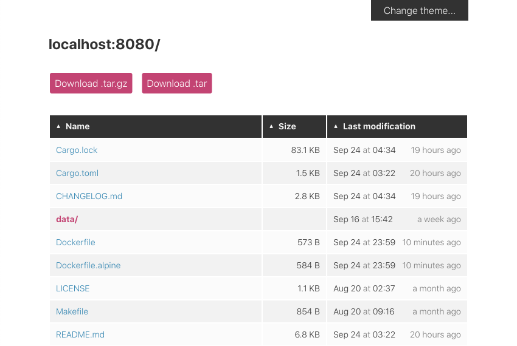
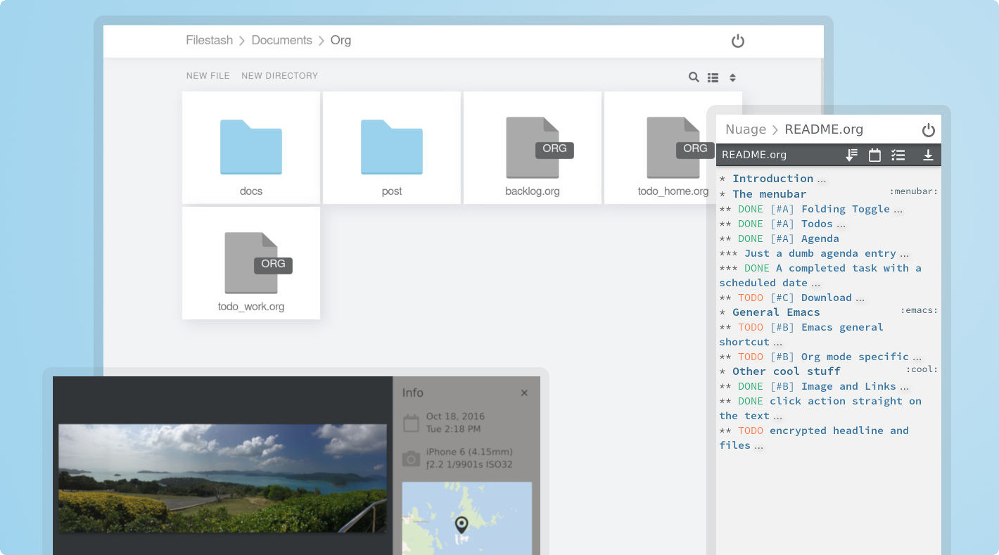

FileSystem
==========

## FileBrowser

📂 Web File Browser

- [Github](https://github.com/filebrowser/filebrowser) (⭐ 21.8k)
- [Live Demo](https://demo.filebrowser.org/)


## Miniserve

🌟 For when you really just want to serve some files over HTTP right now!

[Github](https://github.com/svenstaro/miniserve) (⭐ 5.2k)

```sh
docker run -v /tmp:/tmp -p 5400:8080 --rm -it docker.io/svenstaro/miniserve /tmp
```




## Double Commander

Double Commander is a free cross platform open source file manager with two panels side by side.

- [Github](https://github.com/doublecmd/doublecmd) (⭐ 2.1k)
- [LinuxServer Docker Image](https://hub.docker.com/r/linuxserver/doublecommander)


## FileStash

🦄 A modern web client for SFTP, S3, FTP, WebDAV, Git, Minio, LDAP, CalDAV, CardDAV, Mysql, Backblaze, ...

[Github](https://github.com/mickael-kerjean/filestash) (⭐ 8.5k)



