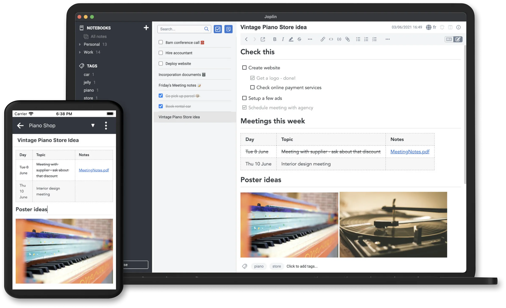
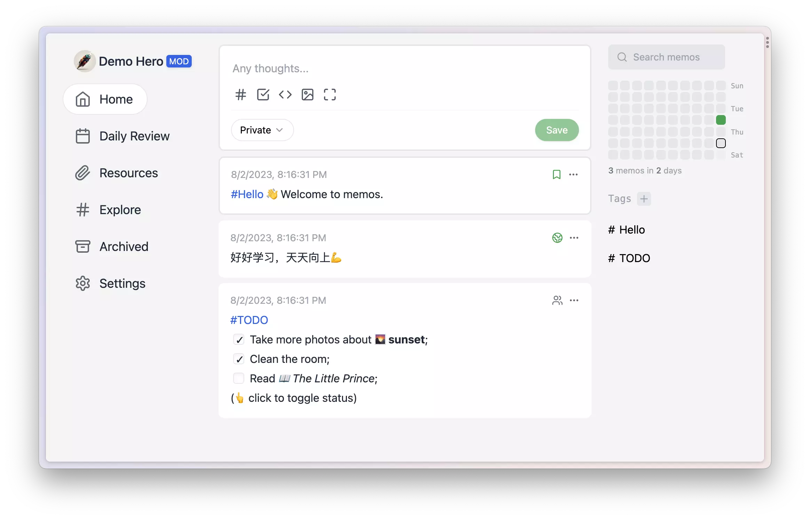

Note-Taking Apps
================

## Joplin

The secure note taking and to-do app with synchronisation capabilities for Windows, macOS, Linux, Android and iOS.

[Github](https://github.com/laurent22/joplin) (⭐ 39.9k)

## Memos

An open source, lightweight note-taking service. Easily capture and share your great thoughts.

[Github](https://github.com/usememos/memos) (⭐ 21.3k)

##  Trilium

Build your personal knowledge base with Trilium Notes

[Github](https://github.com/zadam/trilium) (⭐ 23.9k)

## StandardNotes

Secure note-taking app with powerful end-to-end encryption, unparalleled privacy features, and seamless cross-platform syncing on unlimited devices.

[Github](https://github.com/standardnotes/app) (⭐ 4.6k)

## TagSpaces

TagSpaces is an offline, open source, document manager with tagging & note-taking support

[Github](https://github.com/tagspaces/tagspaces) (⭐ 3.2k)

## Livebook

Automate code & data workflows with interactive Elixir notebooks.

[Github](https://github.com/livebook-dev/livebook) (⭐ 4.1k)
