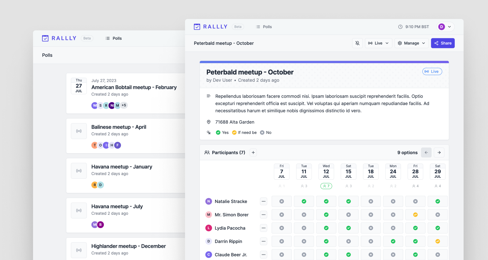

Home/Office
===========

## changedetection.io

The best and simplest free open source website change detection, website watcher, restock monitor and notification service. Restock Monitor, change detection. Designed for simplicity - Simply monitor which websites had a text change for free. Free Open source web page change detection, Website defacement monitoring, Price change notification

[Github](https://github.com/dgtlmoon/changedetection.io) (⭐ 13.6k)

```sh
docker run -d --restart always -p "127.0.0.1:5600:5000" -v datastore-volume:/datastore --name changedetection.io dgtlmoon/changedetection.io
```

## Paperless

A community-supported supercharged version of paperless: scan, index and archive all your physical documents

- [Github](https://github.com/paperless-ngx/paperless-ngx) (⭐ 13k)
- [Docker Install](https://docs.paperless-ngx.com/setup/#docker_script)


## Rally

Doodle alternative.

Rallly is an open-source scheduling and collaboration tool designed to make organizing events and meetings easier.

[Github](https://github.com/lukevella/rallly) (⭐ 2.7k)




## Surveys

### Fider

Open platform to collect and prioritize feedback

[Github](https://github.com/getfider/fider) (⭐ 2.5k)


### LimeSurvey

The most popular FOSS online survey tool on the web.

[Github](https://github.com/LimeSurvey/LimeSurvey) (⭐ 2.4k)


## Open-Event-Server

The Open Event Organizer Server to Manage Events.

[Github](https://github.com/fossasia/open-event-server) (⭐ 2.9k)
