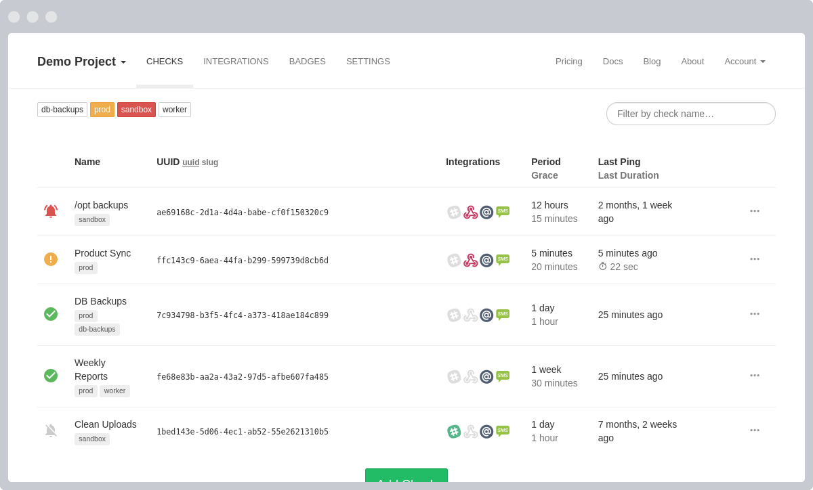
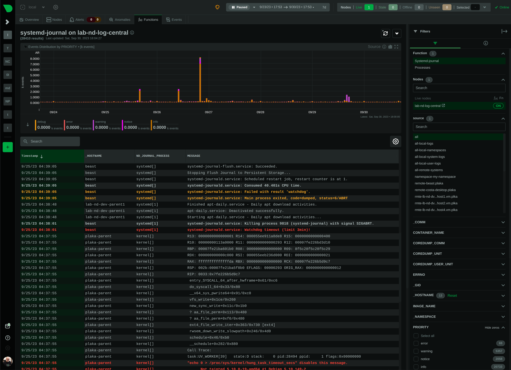

Network
=======

- [Awesome Sysadmin: Metrics Collection](https://github.com/awesome-foss/awesome-sysadmin#metrics--metric-collection)
- [Awesome FOSS: Monitoring](https://github.com/awesome-foss/awesome-sysadmin#monitoring)


## Speedtest

Self-hosted Speed Test for HTML5 and more. Easy setup, examples, configurable, mobile friendly. Supports PHP, Node, Multiple servers, and more

- [Github](https://github.com/librespeed/speedtest) (⭐ 10.5k)
- [Docker Install](https://github.com/librespeed/speedtest/blob/master/doc_docker.md)
- [CLI](https://github.com/librespeed/speedtest-cli)
- [LinuxServer Docker Image](https://hub.docker.com/r/linuxserver/librespeed)


## healthchecks

Open-source cron job and background task monitoring service, written in Python & Django

- [Github](https://github.com/healthchecks/healthchecks) (⭐ 6.9k)
- [LinuxServer Docker Image](https://hub.docker.com/r/linuxserver/healthchecks)





## Uptime-Kuma

A fancy self-hosted monitoring tool.

- [Github](https://github.com/louislam/uptime-kuma) (⭐ 43.1k)
- [Live Demo](https://demo.uptime.kuma.pet/)

```sh
docker run -d --restart=always -p 3001:3001 -v uptime-kuma:/app/data --name uptime-kuma louislam/uptime-kuma:1
```


## netdata

Monitor your servers, containers, and applications, in high-resolution and in real-time!

- [Github](https://github.com/netdata/netdata) (⭐ 66.4k)
- [Docker Install](https://learn.netdata.cloud/docs/installing/docker)




## Other

- [glances](https://github.com/nicolargo/glances) Glances an Eye on your system. A top/htop alternative for GNU/Linux, BSD, Mac OS and Windows operating systems. (⭐ 24k)
- [SmokePing](https://github.com/oetiker/SmokePing) SmokePing is a latency logging and graphing and alerting system. It consists of a daemon process which organizes the latency measurements and a CGI which presents the graphs. (⭐ 1.1k)
  - [LinuxServer Docker Image](https://hub.docker.com/r/linuxserver/smokeping)
- [DashDot](https://github.com/MauriceNino/dashdot) A simple, modern server dashboard, primarily used by smaller private servers (⭐ 1.9k)
- [Prometheus Compose](https://github.com/vegasbrianc/prometheus) (⭐ 4.2k)
- [hertzbeat](https://github.com/dromara/hertzbeat) An open source, real-time monitoring system with custom-monitoring, high performance cluster, prometheus-like and agentless. (⭐ 3.9k)
- [LinuxServer Wireshark Docker Image](https://hub.docker.com/r/linuxserver/wireshark)
- [Vigil](https://github.com/valeriansaliou/vigil) 🚦 Microservices Status Page. Monitors a distributed infrastructure and sends alerts (Slack, SMS, etc.). (⭐ 1.6k)
- [cstate](https://github.com/cstate/cstate) 🔥 Open source static (serverless) status page. Uses hyperfast Go & Hugo, minimal HTML/CSS/JS, customizable, outstanding browser support (IE8+), preloaded CMS, read-only API, badges & more. (⭐ 2.2k)
- [gatus](https://github.com/TwiN/gatus) ⛑ Automated developer-oriented status page (⭐ 4.3k)
