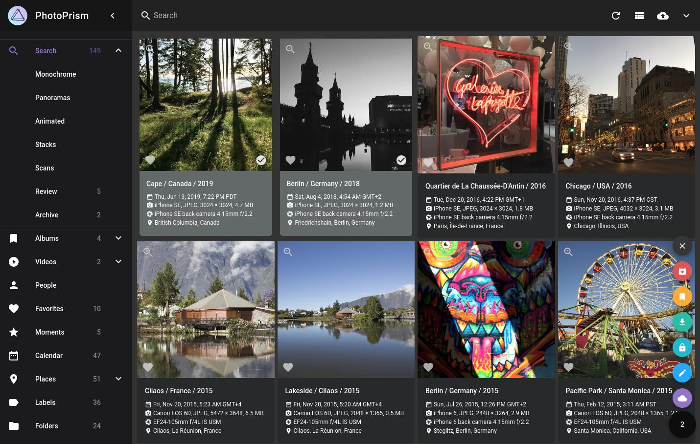

Picture Gallery
===============

# Photoprism

AI-Powered Photos App for the Decentralized Web 🌈💎✨

- [Github](https://github.com/photoprism/photoprism) (⭐ 30.5k)
- [Docker Install](https://docs.photoprism.app/getting-started/docker-compose/) compose.yaml downloads for all OS

# Thumbor

Smart imaging service that enables on-demand cropping, resizing, applying filters and optimizing images.

- [Github](https://github.com/thumbor/thumbor) (⭐ 9.7k)
- [Awesome Thumbor](https://github.com/thumbor/awesome-thumbor)

## Other

- [Immich](https://github.com/immich-app/immich) Self-hosted photo and video backup solution directly from your mobile phone. (⭐ 23.4k)
- [librephotos](https://github.com/LibrePhotos/librephotos) A self-hosted open source photo management service. This is the repository of the backend. (⭐ 6.2k)
- [photoview](https://github.com/photoview/photoview) Photo gallery for self-hosted personal servers (⭐ 4.4k)
- [pixelfed](https://github.com/pixelfed/pixelfed) Photo Sharing. For Everyone. (⭐ 5.2k)
- [Damselfly](https://github.com/webreaper/damselfly) index an extremely large collection of images, and allow easy search and retrieval of those images (⭐ 1.1k)
- [Piwigo](https://github.com/Piwigo/Piwigo) Manage your photos with Piwigo, a full featured open source photo gallery application for the web. Star us on Github! More than 200 plugins and themes available. Join us and contribute! (⭐ 2.9k)
- [Lychee](https://github.com/LycheeOrg/Lychee) A great looking and easy-to-use photo-management-system you can run on your server, to manage and share photos. (⭐ 2.9k)
- [pigallery2](https://github.com/bpatrik/pigallery2) A fast directory-first photo gallery website, with rich UI, optimized for running on low resource servers (especially on raspberry pi) (⭐ 1.5k)
- [Memories](https://github.com/pulsejet/memories) Fast, modern and advanced photo management suite. Runs as a Nextcloud app. (⭐ 1.8k)
