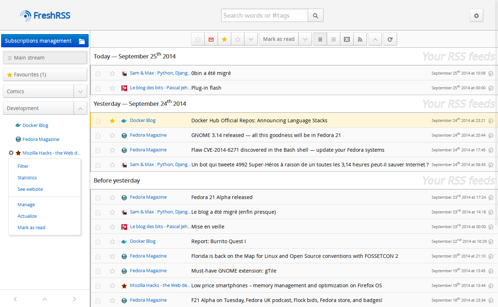

RSS
===

## RSSHub

🍰 Everything is RSSible.  
[Docs](https://docs.rsshub.app/). With browser extension.

- [Github](https://github.com/DIYgod/RSSHub) (⭐ 27.2k)
- [Installation](https://docs.rsshub.app/install/)

Also see `rsshub-compose.yaml`


## RSS-Bridge

The RSS feed for websites missing it

- [Github](https://github.com/RSS-Bridge/rss-bridge) (⭐ 6.5k)
- [Live Demo](https://rss-bridge.org/bridge01/)


```yaml
version: '2'

services:
  rss-bridge:
    image: rssbridge/rss-bridge:latest
    volumes:
      - </local/custom/path>:/config
    ports:
      - 5300:80
    restart: unless-stopped
```


## FreshRSS

A free, self-hostable news aggregator…

- [Github](https://github.com/FreshRSS/FreshRSS) (⭐ 7.4k)
- [Linuxserver Docker Image](https://hub.docker.com/r/linuxserver/freshrss)





## Other


- [stringer](https://github.com/stringer-rss/stringer) A self-hosted, anti-social RSS reader. (⭐ 3.7k)
- [commafeed](https://github.com/Athou/commafeed) Google Reader inspired self-hosted RSS reader. (⭐ 2.3k)
- [miniflux v2](https://github.com/miniflux/v2) Minimalist and opinionated feed reader (⭐ 5.7k)
- [Yarr](https://github.com/nkanaev/yarr) yet another rss reader (⭐ 2.4k)
- [selfoss](https://github.com/fossar/selfoss) multipurpose rss reader, live stream, mashup, aggregation web app (⭐ 2.3k)
- [NewsBlur](https://github.com/samuelclay/NewsBlur) NewsBlur is a personal news reader that brings people together to talk about the world. A new sound of an old instrument. (⭐ 6.6k)
