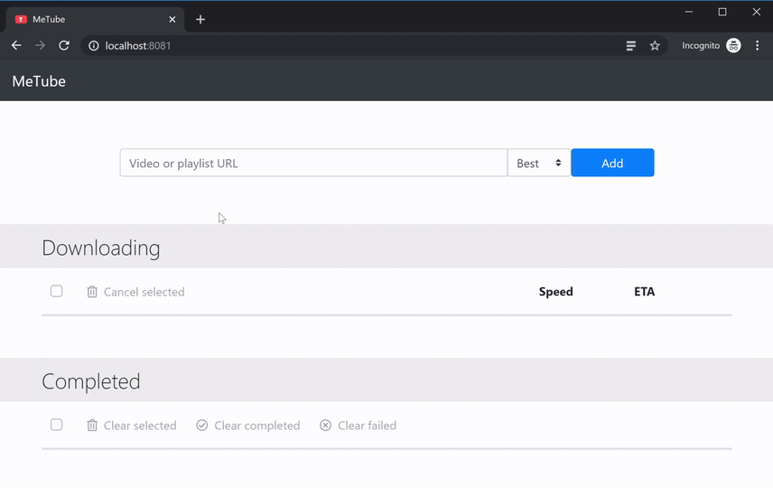
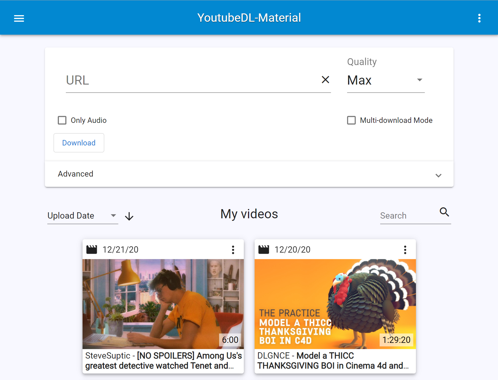

Youtube
=======

## Metube

Pretty cool YouTube downloader (web UI for youtube-dl / yt-dlp)

[Github](https://github.com/alexta69/metube) (⭐ 2.4k)

```sh
docker run -d -p 8081:8081 -v /path/to/downloads:/downloads ghcr.io/alexta69/metube
```




## YoutubeDL-Material

Self-hosted YouTube downloader built on Material Design

- [Github](https://github.com/Tzahi12345/YoutubeDL-Material) (⭐ 2.2k)
- [Docker Install](https://github.com/Tzahi12345/YoutubeDL-Material?tab=readme-ov-file#Docker)





## TubeArchivist

Your self hosted YouTube media server. Subscribe to channels, download videos, indexing, ...

[Github](https://github.com/tubearchivist/tubearchivist) (⭐ 3.6k)

```sh
# Starts on port 8000
# Username: tubearchivist
# Password: verysecret
docker compose up -d
```


## Tubesync

**PREVIEW RELEASE**

Syncs YouTube channels and playlists to a locally hosted media server.

[Github](https://github.com/meeb/tubesync) (⭐ 1.5k)

```yaml
version: '3.7'

services:
  tubesync:
    image: ghcr.io/meeb/tubesync:latest
    container_name: tubesync
    restart: unless-stopped
    ports:
      - 4848:4848
    volumes:
      - /some/directory/tubesync-config:/config
      - /some/directory/tubesync-downloads:/downloads
    environment:
      - TZ=Europe/London
      - PUID=1000
      - PGID=1000
```
